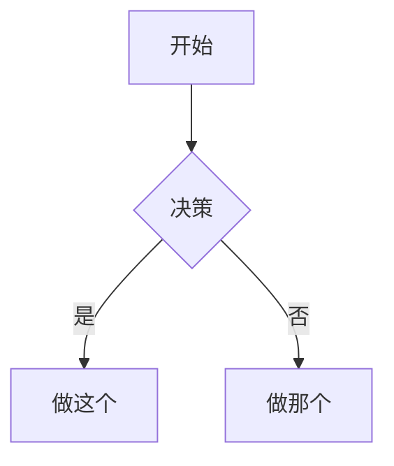

# Obsidian 风味 Markdown 技能

创建并编辑有效的 Obsidian 风味 Markdown。Obsidian 在 CommonMark 和 GFM 基础上扩展了双向链接、嵌入、标注、属性、注释及其他语法。本技能仅涵盖 Obsidian 专属扩展内容——基础 Markdown（标题、粗体、斜体、列表、引用、代码块、表格）为假定已知内容。

## 工作流程：创建 Obsidian 笔记

1. **添加 frontmatter** 包含属性（title、tags、aliases）置于文件顶部。参见 [PROPERTIES.md](references/PROPERTIES.md) 了解所有属性类型。
2. **撰写内容** 使用标准 Markdown 构建结构，外加下方的 Obsidian 专属语法。
3. **链接相关笔记** 使用双向链接 (`[[笔记]]`) 连接 vault 内部笔记，或使用标准 Markdown 链接指向外部 URL。
4. **嵌入内容** 使用 `![[嵌入]]` 语法从其他笔记、图片或 PDF 中嵌入内容。参见 [EMBEDS.md](references/EMBEDS.md) 了解所有嵌入类型。
5. **添加标注** 使用 `> [!类型]` 语法高亮信息。参见 [CALLOUTS.md](references/CALLOUTS.md) 了解所有标注类型。
6. **验证** 确认笔记在 Obsidian 阅读视图正确渲染。

> 选择双向链接还是 Markdown 链接时：vault 内部的笔记使用 `[[双向链接]]`（Obsidian 会自动跟踪重命名），外部 URL 才使用 `[文本](url)`。

## 内部链接（双向链接）

```markdown
[[笔记名称]] 链接到笔记
[[笔记名称 | 显示文本]] 自定义显示文本
[[笔记名称 # 标题]] 链接到标题
[[笔记名称 # ^区块 ID]] 链接到区块
[# 当前笔记中的标题]] 当前笔记内标题链接
```

通过在任意段落后追加 `^ 区块 ID` 定义区块 ID：

```markdown
这是可以被链接的段落。^my-block-id
```

对于列表和引用，将区块 ID 放在块之后的单独行：

```markdown
> 引用块

^quote-id
```

## 嵌入

在双向链接前加 `!` 即可将内容嵌入行内：

```markdown
![[笔记名称]] 嵌入完整笔记
![[笔记名称 # 标题]] 嵌入章节
![[图片.png]] 嵌入图片
![[图片.png|300]] 嵌入宽度为 300 的图片
![[文档.pdf#page=3]] 嵌入 PDF 第 3 页
```

参见 [EMBEDS.md](references/EMBEDS.md) 了解音频、视频、搜索嵌入及外部图片。

## 标注

```markdown
> [!note]
> 基础标注。

> [!warning] 自定义标题
> 带自定义标题的标注。

> [!faq]- 默认折叠
> 可折叠标注（- 表示折叠，+ 表示展开）。
```

常见类型：`note`、`tip`、`warning`、`info`、`example`、`quote`、`bug`、`danger`、`success`、`failure`、`question`、`abstract`、`todo`。

参见 [CALLOUTS.md](references/CALLOUTS.md) 了解完整列表、别名嵌套及自定义 CSS 标注。

## 属性（Frontmatter）

```yaml
---
title: 我的笔记
date: 2024-01-15
tags:
 - 项目
 - 进行中
aliases:
 - 备用名称
cssclasses:
 - custom-class
---
```

默认属性：`tags`（可搜索的标签）、`aliases`（笔记的其他名称用于链接建议）、`cssclasses`（用于样式的 CSS 类）。

参见 [PROPERTIES.md](references/PROPERTIES.md) 了解所有属性类型、标签语法规则及高级用法。

## 标签

```markdown
#标签 行内标签
#嵌套 / 标签 分层级的标签
```

标签可包含字母、数字（不能首字符）、下划线、连字符和斜杠。标签也可在 frontmatter 的 `tags` 属性中定义。

## 注释

```markdown
这是可见内容 %%但这部分被隐藏%% 的文字。

%%
整个块在阅读视图中被隐藏。
%%
```

## Obsidian 专属格式

```markdown
==高亮文字== 高亮语法
```

## 数学公式（LaTeX）

```markdown
行内：$e^{i\pi} + 1 = 0$

块级：
$$
\frac{a}{b} = c
$$
```

## 图表（Mermaid）

````markdown

````

要将 Mermaid 节点链接到 Obsidian 笔记，添加 `class NodeName internal-link;`。

## 脚注

```markdown
带有脚注的文字[^1]。

[^1]: 脚注内容。

行内脚注。^[这是一个行内脚注。]
```

## 完整示例

````markdown
---
title: Alpha 项目
date: 2024-01-15
tags:
 - 项目
 - 进行中
status: in-progress
---

# Alpha 项目

本项目旨在 [[改进工作流]] 使用现代技术。

> [!important] 关键截止日期
> 第一个里程碑将于 ==1 月 30 日== 到期。

## 任务

- [x] 初始规划
- [ ] 开发阶段
  - [ ] 后端实现
  - [ ] 前端设计

## 笔记

该算法使用 $O(n \log n)$ 排序。详见 [[算法笔记 # 排序]]。

![[架构图.png|600]]

在 [[2024-01-10 会议笔记 # 决定]] 中审查。
````

## 参考资料

- [Obsidian Flavored Markdown](https://help.obsidian.md/obsidian-flavored-markdown)
- [Internal links](https://help.obsidian.md/links)
- [Embed files](https://help.obsidian.md/embeds)
- [Callouts](https://help.obsidian.md/callouts)
- [Properties](https://help.obsidian.md/properties)
